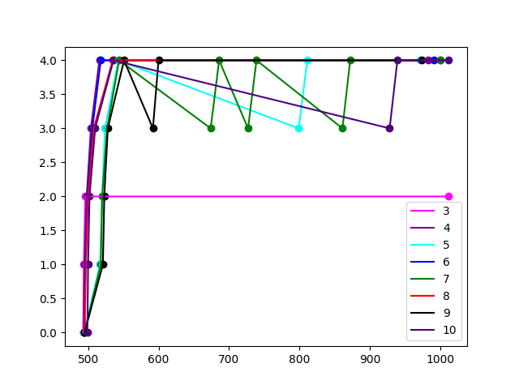

# Modified xv-6

Minor tweaks to xv-6 Operating System developed in MIT. 

### Execution

```
$ make qemu SCHEDULER=FCFS
```
`SCHEDULER` flag can be set to `FCFS`, `PBS` or `MLFQ`. Set by default to `RR`.

## System Calls

The system calls added are as follows:

### waitx

The prototype of `waitx` as follows:
```
int waitx(int* wtime, int* rtime)
```
When a process calls waitx, the calling processes sleeps till one of its children is done executing. It returns the PID of the child process. If a process does not have any child processes, it returns -1. <br>

It takes 2 arguments, pointers to the integers which will be assigned values. `wtime` is the total number of ticks the child process was waiting for CPU. `rtime` is the total number of ticks the child process ran for. <br>

A test program is written utilizing the waitx system call called `time`. It takes as input a test program and returns the waiting time and execution time of the current process.

### proc_info

proc info system call gives the details of all the processes currently present in the system. `ps` utilizes this system call. The output of the ps system call looks as follows: <br>
```
PID  Priority  State    r_time w_time n_run  cur_q   q0   q1   q2   q3   q4 

 1    -1       sleeping    4      0      23     1    2    2    0    0   0
 2    -1       sleeping    1      0      19     0    1    0    0    0   0
 5    -1       runnable    135    2      13     4    1    2    4    8   120

```

### set_priority

The `set priority` function call changes the priority of the process. The prototype is as follows:
```
int set_priority (int new_priority, int pid)
```
The priority of the process with PID as `pid` is set to `new_priority`. If the priority of the process increases (its numerical value decreases), rescheduling happens.. If the process with given `pid` does not exist, the function returns -1, else it returns the `old_priority` of the process.

## Scheduling Algorithms

The scheduling algorithms implemented are as follows:

### First Come First Serve (FCFS)

As the name suggests, the CPU schedules the process which was created first, that is, CPU always selects the process with minimum creation time. The SCHEDULER flag must be set to FCFS for this scheduling algorithm to be selected.

### Round Robin

The CPU gives each process a time quantum of 1 tick. The process is preempted after its time quantum. This is the default scheduler used.

### Priority Based Scheduling

Each process has a priority associated with it and the CPU selects the process with highest priority. If two or more processes with the same priority exist, they are scheduled in Round Robin fashion with a time quanta of 1 second. This is done by always selecting the process with maximm wait time from all the processes with same priority. Every process is preempted after 1 tick to check if any higher priority process has been created. If there is a higher priority proces, it is selected. If processes with the same priority are present, the current process waits till all the other processes with same priority also get a chance. If the process is the only highest priority process, it will be scheduled again. <br>
The priority of a process is changes using the `set_priotity` system call. This scheduler can be used by setting the SCHEDULER flag to PBS.

### Multi-Level Feedback Queue

There are 5 priority queues Q0, Q1, Q2, Q3 and Q4, in the order of decreasing priority. Their time quanta are 1 tick, 2 ticks, 4 ticks, 8 ticks and 16 ticks respectively. These queues are implemented by storing the pid of the processes. The functions involved in the queue implementation are `q_init()` for initialisation, `push_queue(int pid, int cur_q)` for pushing into the queue, `pop_queue(int pid)` and `pop_pid_queue(int pid, int cur_q)` for popping first element and popping element based on PID respectively and `top_queue(int cur_q)` to find the first element of the queue.<br>

On initiation, every process is in the Q0 (Highest priority). If a process voluntarily relenquishes the CPU, it will retain its queue, and after the completion of IO, it is placed at the end of the same queue. `Some process might exploit this by giving up the CPU exactly before the its quantum is completed, thereby ensuring its position in the same queue`. If it exceeds its time quanta, it is preempted and demoted to a lower queue. <br>

To prevent starvation, there is a limit on the amount of time a process can wait in a given queue, after which it will be promoted to a higher queue. This limit varies from queue to queue and is 10,20,30 and 40 for queue Q1, Q2, Q3 and Q4 respectively.

## Comparision

For comparision, the `benchmark` program is run on different schedulers. To make the comparision more clear and concise, the CPUS flag has been set to 1, that is, all the processes execute on one CPU only. The results are as follows:

RR (default): <br>
```
Process: 0 Finished
4 Waiting Time : 229  Running Time : 365
Process: 1 Finished
5 Waiting Time : 654  Running Time : 320
Process: 2 Finished
6 Waiting Time : 898  Running Time : 280
Process: 3 Finished
7 Waiting Time : 1012  Running Time : 239
Process: 4 Finished
8 Waiting Time : 1124  Running Time : 200
Process: 8 Finished
12 Waiting Time : 1157  Running Time : 40
Process: 5 Finished
9 Waiting Time : 1158  Running Time : 162
Process: 6 Finished
10 Waiting Time : 1158  Running Time : 120
Process: 7 Finished
11 Waiting Time : 1158  Running Time : 82
Process: 9 Finished
13 Waiting Time : 1158  Running Time : 0
```

FCFS: <br>
```
Process: 0 Finished
4 Waiting Time : 2  Running Time : 353
Process: 1 Finished
5 Waiting Time : 356  Running Time : 319
Process: 2 Finished
6 Waiting Time : 675  Running Time : 278
Process: 3 Finished
7 Waiting Time : 953  Running Time : 246
Process: 4 Finished
8 Waiting Time : 1198  Running Time : 207
Process: 5 Finished
9 Waiting Time : 1406  Running Time : 155
Process: 6 Finished
10 Waiting Time : 1562  Running Time : 120
Process: 7 Finished
11 Waiting Time : 1682  Running Time : 85
Process: 8 Finished
12 Waiting Time : 1766  Running Time : 38
Process: 9 Finished
13 Waiting Time : 1805  Running Time : 0
```

PBS: <br>
```
Process: 5 Finished
9 Waiting Time : 1  Running Time : 161
Process: 4 Finished
8 Waiting Time : 162  Running Time : 209
Process: 6 Finished
10 Waiting Time : 1  Running Time : 121
Process: 3 Finished
7 Waiting Time : 493  Running Time : 247
Process: 7 Finished
11 Waiting Time : 0  Running Time : 85
Process: 2 Finished
6 Waiting Time : 825  Running Time : 285
Process: 8 Finished
12 Waiting Time : 0  Running Time : 40
Process: 1 Finished
5 Waiting Time : 1151  Running Time : 332
Process: 9 Finished
13 Waiting Time : 0  Running Time : 0
Process: 0 Finished
4 Waiting Time : 1483  Running Time : 376
```

MLFQ: <br>
```
Process: 0 Finished
4 Waiting Time : 224  Running Time : 357
Process: 1 Finished
5 Waiting Time : 748  Running Time : 321
Process: 3 Finished
7 Waiting Time : 1141  Running Time : 238
Process: 4 Finished
8 Waiting Time : 1300  Running Time : 198
Process: 2 Finished
6 Waiting Time : 1306  Running Time : 279
Process: 5 Finished
9 Waiting Time : 1529  Running Time : 159
Process: 8 Finished
12 Waiting Time : 1597  Running Time : 40
Process: 7 Finished
11 Waiting Time : 1587  Running Time : 84
Process: 6 Finished
10 Waiting Time : 1582  Running Time : 120
Process: 9 Finished
13 Waiting Time : 1645  Running Time : 0
```

The average waiting time as well as the range for the different schedulers are as follows:

```
Scheduler   Average       Range
   RR        970.6      229 - 1158
  FCFS       1140.5      2 - 1805
   PBS       411.6       0 - 1483
  MLFQ       1265.9     224 - 1645
```

The default scheduler is the Round Robin. Except for the initial few processes (more CPU intensive and negligible I/O), almost all the later processes have similar wait times (which is very close to the average). This is expected, as all processes are treated fairly by the Round Robin scheduler. The initial processes having a low wait time can be amounted to the fact that they got a large chunk of CPU while the later processes were in I/O. This scheduler has the least overhead for selection.<br>

For FCFS, the waiting time is very high for the last processes (which are I/O intensive) and very low for the first few processes (CPU intensive). The overhead (time spent in selecting the process) is also low for FCFS (not as low as RR). The processes created late have to wait for a long time to get the CPU, for example process 9 (pid 13) waits for 1805 ticks to get CPU just to run for less than 1 tick. (It is an I/O bound process). Thus, it penalises the later processes very badly. <br>

For PBS, the I/O bound processes(last ones) are given a higher priority and thus, they have a very less waiting time (3 processes have waiting time 0 and 2 have waiting time 1, thus executing almost as soon as they are ready). The lower processes also have less waiting time because they complete a significant chunk of their CPU processes while the I/O intensive processes do I/O (before they compete with high priority processes). The overhead for process selection is also very low(more than RR, equivalent to FCFS). Thus, the average waiting time is very low for PBS. However, there is a risk of starvation as lower priority processes might have to wait for a long time to get CPU. (Process 0 (pid 4) which has the lowest waits for 1483 ticks, almost four times the average waiting time). <br>

MLFQ gives the highest average waiting time of all 4. One of the main contributing factor is the large overhead involved in queue popping and aging (have to iterate through many processes). The waiting times are similar indicating that each process gets a fair share of the CPU. This can be expected as MLFQ not only decreases priority of the CPU hogging processes, it also increases the priority of the processes not  getting CPU for a long time (starvation). Note that while the I/O bound processes were given a higher priority in PBS, all the processes were initially given the same priority in MLFQ. Different results can be expected if the priority is not same initially. <br>

## Timeline Graph for MLFQ

The following graph gives the movement of the processes between different queues, based on the user program `graph_plot`. To plot for a different program, change the graph_content.txt. The graph plotting is done in the Graph.ipynb file.

The time in between might be either running on the CPU or waiting for I/O. (PID 1 and 2 are not related to the graph_plot)




